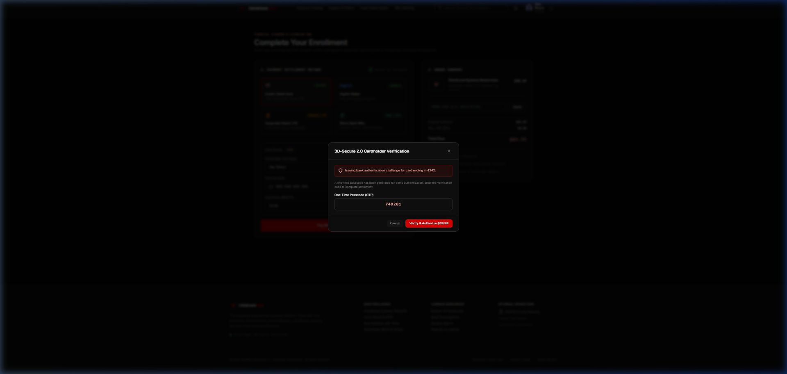
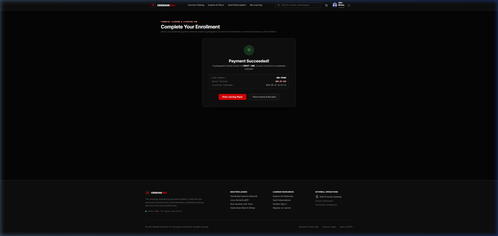
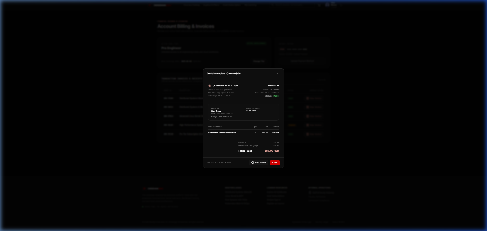

# 🌌 Obsidian Education — Engineering & Architecture Mastery Platform

[](https://www.typescriptlang.org/)
[](https://reactjs.org/)
[](https://nestjs.com/)
[](https://tailwindcss.com/)
[](https://github.com/pmndrs/zustand)
[](#responsive-design--cross-device-support)
[](#multi-channel-financial-settlement-engine)
[](#multi-portal-architecture--strict-role-isolation)
[](LICENSE)

An enterprise-grade, high-aesthetic SaaS e-learning platform architected specifically for advanced software engineering, distributed systems, and cloud infrastructure courses. Built with a unified **Obsidian Dark** aesthetic (`#0c0f17` / `#161b26`), strictly isolated multi-portal role-based access control, a 4-channel financial clearing engine, responsive views, interactive practice quizzes, and an intuitive curriculum builder.

---

## 📸 Visual Showcase & Platform Tour

### 1. Landing Page & Hero Section
*Hero section with animated grid lines, high-impact typography, real-time platform statistics, and featured high-performance engineering tracks.*


---

### 2. Multi-Channel Payment & Settlement Gateway
*Enterprise checkout supporting Credit Card with live brand detection, PayPal Express, Corporate Check / PO, and Direct Bank Wire.*


---

### 3. 3D-Secure 2.0 Cardholder Verification
*Simulated two-factor cardholder authentication challenge for high-security commercial course transactions.*


---

### 4. Immediate Cryptographic License Activation
*Real-time settlement confirmation screen granting instant student access and generating an immutable order receipt.*


---

### 5. Official Printable Invoice & Tax Receipt
*Detailed institutional invoice with itemized curriculum lines, tax breakdown, company address, remit details, and printable PDF dialog.*


---

### 6. Student Learning Dashboard & Analytics
*Comprehensive student dashboard displaying enrolled courses, overall completion rate, total learning hours, and quick 'Resume Course' actions.*


---

### 7. Interactive Learning Player & Practice Quizzes
*Rich distraction-free learning player featuring video playback, persistent lecture notes, and a built-in 3-question practice quiz.*


---

### 8. Staff & Faculty Gateway Login
*Dedicated, isolated faculty gateway login (`/portal/login`) restricted exclusively to Instructors, Admins, and Super Administrators.*


---

### 9. Instructor Studio & Course Management
*Instructor studio displaying published courses, active student metrics, average ratings, and a button to launch the 4-step Course Builder Wizard.*


---

### 10. Admin Operations & Offline Verification Queue
*Administrative control center featuring instructor applications, verification workflows, and check/wire receipt approvals.*


---

### 11. Super Admin Governance & Global Financial Ledger
*Super Admin governance hub (`/superadmin`) with platform uptime monitoring, global audit logs, emergency maintenance toggles, and live payment moderation.*


---

## ✨ Core Features & Platform Capabilities

### 💳 Multi-Channel Financial Settlement Engine
The platform implements a comprehensive payment suite handling both digital instant clearing and institutional offline workflows:
1. **Credit / Debit Cards (Stripe Simulation)**:
   - Real-time card brand detection (Visa, Mastercard, Amex, JCB).
   - Cardholder verification and formatting (`XXXX XXXX XXXX XXXX`).
   - Simulated **3D-Secure 2.0** OTP challenge.
   - Immediate course enrollment and receipt issuance.
2. **PayPal Express Wallet**:
   - One-click global digital wallet settlement.
   - Interactive PayPal authorization modal dialog.
   - Real-time balance or connected account charging.
3. **Corporate Checks & Purchase Orders (PO)**:
   - Check Reference / Bank Draft and PO Number entry.
   - Corporate institution / university accounts payable mapping.
   - Orders placed in **Pending Verification** queue for administrator approval upon clearance.
4. **Direct Bank Wire / ACH (SWIFT & Fedwire)**:
   - Direct wire instructions: Beneficiary, Bank, SWIFT/BIC (`CHASUS33XXX`), IBAN (`US89CHAS12345678901234`).
   - Unique generated Remittance Reference (`OBS-WIRE-XXXXX`).
   - Queueing for administrative bank reconciliation.
5. **Administrative Payment Moderation**:
   - Admin and SuperAdmin dashboards featuring an **Offline Verification Queue**.
   - One-click "Confirm Receipt & Unlock" action immediately activates student courses.
   - Single-click refund action revoking access when required.
   - CSV export of global platform financial ledgers.

---

### 📱 Responsive Design & Cross-Device Support
- **Mobile (< 768px)**:
  - Mobile topbar with brand mark, active route title, and animated hamburger drawer trigger.
  - Full-screen sliding drawer navigation with backdrop blur.
  - Collapsible filter bottom sheet for course search.
  - Compact cards and horizontally scrollable data tables (`overflow-x-auto`).
- **Tablet (768px – 1023px)**:
  - 2-column bento grids for statistics, catalog cards, and settings.
  - Adaptive course curriculum sidebar with tap-to-expand sections.
- **Desktop (≥ 1024px)**:
  - Fixed 64-width obsidian navigation bar with contextual badges and profile menu.
  - 3-column & 4-column bento grids with hover states.

---

### 🛡️ Multi-Portal Architecture & Strict Role Isolation
The platform implements strict role-based authorization with separate entry portals:
1. **Student Portal (`/auth/login`, `/auth/register`)**:
   - Only users with role `student` can log in here.
   - Redirects to `/dashboard` upon authentication.
   - Any attempt to access `/instructor`, `/admin`, or `/superadmin` displays a dedicated **403 Access Denied** barrier.
2. **Staff Gateway (`/portal/login`)**:
   - High-security entry portal specifically for `instructor`, `admin`, and `superadmin`.
   - Students cannot log in via this gateway.
   - Authenticated staff are routed strictly to their designated operational areas:
     - `instructor` ➔ `/instructor`
     - `admin` ➔ `/admin`
     - `superadmin` ➔ `/superadmin`
3. **Cross-Role Enforcer**:
   - Instructors attempting to visit `/admin` or `/superadmin` receive a 403 Forbidden screen.
   - Admins attempting to visit `/superadmin` receive a 403 Forbidden screen.

---

### 🎓 Dynamic Course Builder (4-Step Wizard)
- **Step 1: Core Metadata**: Title, subtitle, engineering category, difficulty level, prerequisites.
- **Step 2: Curriculum & Lectures**: Add sections, attach video URLs, lecture summaries, and estimated runtimes.
- **Step 3: Pricing & Access**: Set regular price, discount price, and enrollment caps.
- **Step 4: Review & Publish**: Comprehensive preview with status set to `pending_review` or `published`.

---

## 🔑 Demo Accounts & Pre-Configured Credentials

All accounts come pre-seeded with sample data:

| Portal | Role | Email | Password | Allowed Dashboards |
| :--- | :--- | :--- | :--- | :--- |
| **Student** | `student` | `alex.rivera@engineer.io` | `StudentPass123!` | `/dashboard`, `/courses`, `/learn/*`, `/account/billing` |
| **Staff Gateway** | `instructor` | `marcus.vance@obsidian.edu` | `InstructorPass123!` | `/instructor/*` |
| **Staff Gateway** | `admin` | `elena.rostova@obsidian.edu` | `AdminPass123!` | `/admin/*` |
| **Staff Gateway** | `superadmin` | `viktor.kane@obsidian.edu` | `SuperAdminPass123!` | `/superadmin/*`, `/admin/*`, `/instructor/*` |

---

## 🏗️ Architecture & Technology Stack

```
education-platform/
├── backend/                  # NestJS 10 REST API Server
│   ├── src/
│   │   ├── auth/             # Multi-role authentication & JWT guards
│   │   ├── courses/          # Course catalog, curriculum & reviews
│   │   ├── enrollments/      # Student course enrollments & progress
│   │   ├── payments/         # Multi-channel payments (Card, PayPal, Check, Wire)
│   │   ├── subscriptions/    # Recurring SaaS subscription plans
│   │   ├── admin/            # Administrative metrics, approvals & moderation
│   │   ├── superadmin/       # Sovereign governance, ledger & audit logs
│   │   ├── users/            # User repository & RBAC definitions
│   │   ├── app.module.ts     # Root NestJS module
│   │   └── main.ts           # Server bootstrap (Port 3001)
│   └── test/                 # E2E & unit test suites
│
├── frontend/                 # React 18 + Vite + Tailwind SPA
│   ├── src/
│   │   ├── components/       # Shared UI, layout & navigation
│   │   │   └── layout/       # Responsive DashboardSidebar, Navbar, Footer
│   │   ├── pages/
│   │   │   ├── public/       # Home, Search, CourseDetail, Cart, Checkout, Pricing
│   │   │   ├── auth/         # Student Login, Register, Staff Gateway
│   │   │   ├── student/      # Student Dashboard, Learning Player, Billing
│   │   │   ├── instructor/   # Studio Dashboard, Course Builder Wizard, Analytics
│   │   │   ├── admin/        # Admin Dashboard, Instructor/Course Mgmt, Check Queue
│   │   │   └── superadmin/   # System Health, Ledger, Audit Logs, Settings
│   │   ├── store/            # Zustand stores (Auth, Cart/Payments, Courses, Learning)
│   │   ├── types/            # TypeScript interfaces & domain models
│   │   ├── App.tsx           # Route tree & RBAC protected routes
│   │   └── index.css         # Obsidian dark design tokens & utilities
│   └── public/               # Static assets & icons
│
└── docs/
    └── screenshots/          # 13 High-resolution platform screenshots
```

---

## 🚀 Getting Started

### Prerequisites
- **Node.js**: v18.0.0 or higher
- **npm**: v9.0.0 or higher
- **Git**

### Installation

1. **Clone the repository:**
   ```bash
   git clone https://github.com/mikhailemad999/education-platform.git
   cd education-platform
   ```

2. **Install dependencies:**
   ```bash
   # Install root dependencies
   npm install

   # Install frontend dependencies
   cd frontend
   npm install

   # Install backend dependencies
   cd ../backend
   npm install
   cd ..
   ```

3. **Start the Development Servers:**

   **Terminal 1 — Backend API (Port 3001):**
   ```bash
   cd backend
   npm run start:dev
   ```

   **Terminal 2 — Frontend Application (Port 5173):**
   ```bash
   cd frontend
   npm run dev
   ```

4. **Access the application:**
   - Public & Student App: [http://localhost:5173](http://localhost:5173)
   - Staff & Faculty Gateway: [http://localhost:5173/portal/login](http://localhost:5173/portal/login)
   - Backend Health Check: [http://localhost:3001/api/courses](http://localhost:3001/api/courses)

---

## 📡 REST API Reference

| Method | Endpoint | Description | Auth Required |
| :--- | :--- | :--- | :--- |
| `POST` | `/api/auth/login` | Student login endpoint | No |
| `POST` | `/api/auth/portal/login` | Staff gateway login endpoint | No |
| `POST` | `/api/auth/register` | Student self-registration | No |
| `GET` | `/api/courses` | List all published courses with filters | No |
| `GET` | `/api/courses/:id` | Retrieve single course with full syllabus | No |
| `POST` | `/api/payments/credit-card` | Process Stripe card payment & instant enrollment | Yes (JWT) |
| `POST` | `/api/payments/paypal` | Process PayPal express capture & instant enrollment | Yes (JWT) |
| `POST` | `/api/payments/check` | Register check/PO order (status: pending) | Yes (JWT) |
| `POST` | `/api/payments/bank-transfer`| Register direct wire remittance (status: pending) | Yes (JWT) |
| `PUT` | `/api/payments/:id/approve` | Approve check/wire payment & unlock course | Yes (Admin/SuperAdmin) |
| `PUT` | `/api/payments/:id/refund` | Refund payment and revoke access | Yes (SuperAdmin) |
| `POST` | `/api/payments/webhook` | Webhook listener for external gateway events | No |
| `GET` | `/api/superadmin/payments` | Retrieve global transaction ledger | Yes (SuperAdmin) |
| `GET` | `/api/subscriptions/plans` | List available SaaS recurring subscription tiers | No |
| `POST` | `/api/payments/subscribe` | Activate recurring subscription | Yes (JWT) |
| `PUT` | `/api/superadmin/subscriptions/:id/cancel` | Cancel active user subscription | Yes (SuperAdmin) |

---

## 📄 License

This project is licensed under the **MIT License** — feel free to use and adapt it for educational and commercial purposes.
