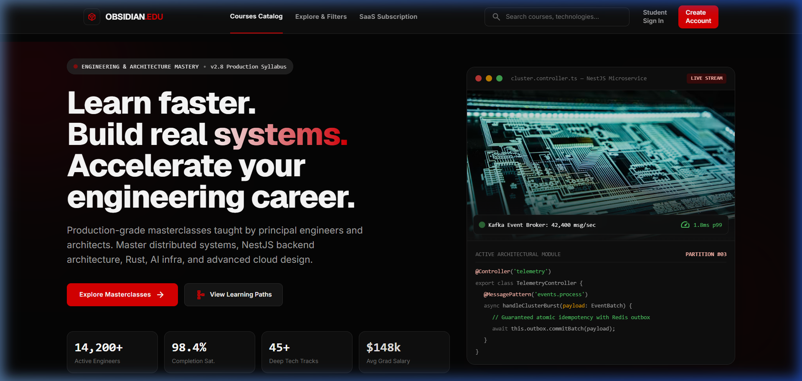
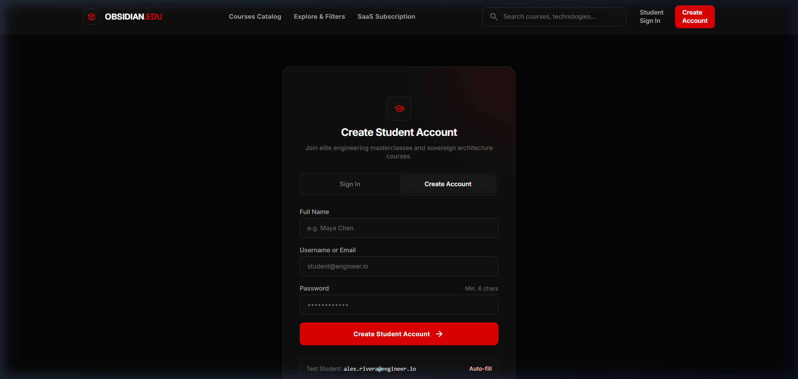
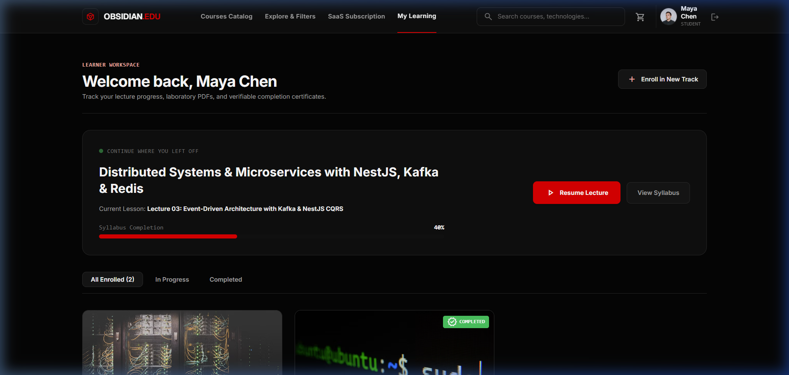
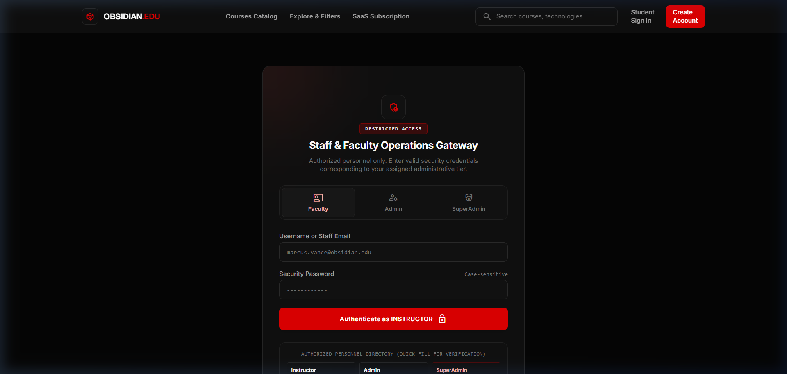
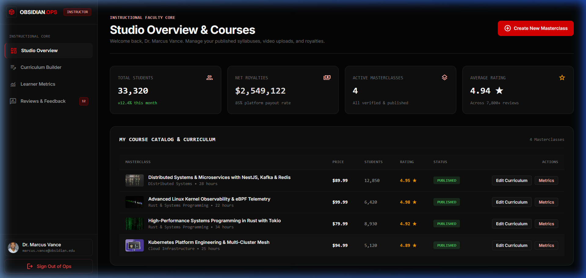
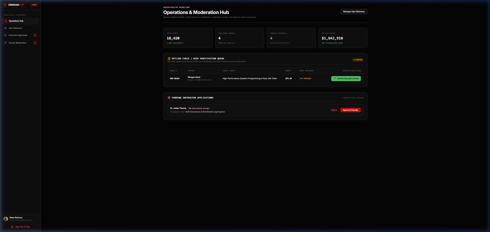
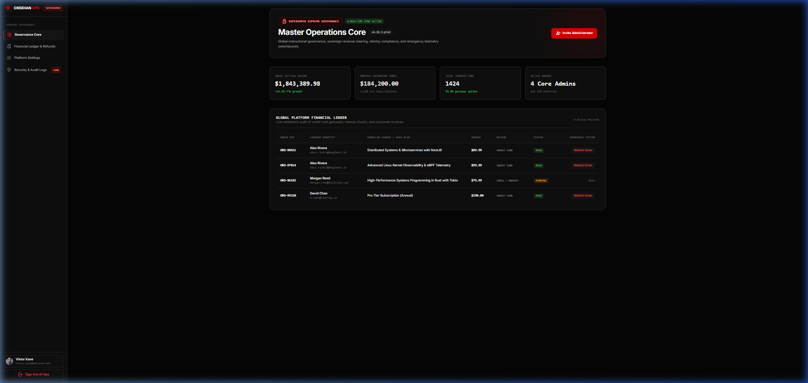
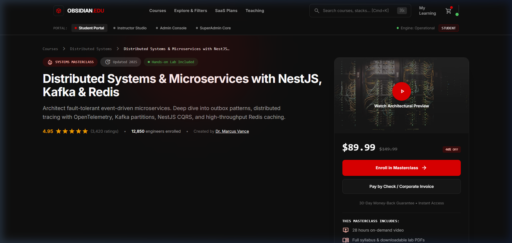
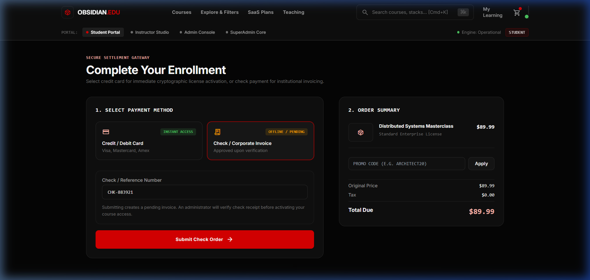
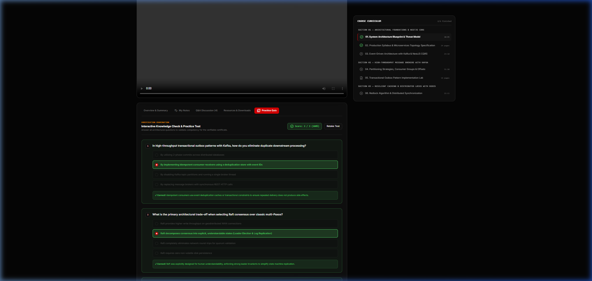

# 🌌 Obsidian Education — Engineering & Architecture Mastery Platform

[](https://www.typescriptlang.org/)
[](https://reactjs.org/)
[](https://nestjs.com/)
[](https://tailwindcss.com/)
[](https://github.com/pmndrs/zustand)
[](#responsive-design--cross-device-support)
[](#multi-portal-architecture--strict-role-isolation)
[](LICENSE)

An enterprise-grade, high-aesthetic SaaS e-learning platform architected specifically for advanced software engineering, distributed systems, and cloud infrastructure courses. Built with a unified **Obsidian Dark** aesthetic (`#0c0f17` / `#161b26`), strictly isolated multi-portal role-based access control, dual payment options, responsive views, interactive practice quizzes, and an intuitive curriculum builder.

---

## 📸 Visual Showcase & Platform Tour

### 1. Landing Page & Hero Section
*Hero section with animated grid lines, high-impact typography, real-time platform statistics, and featured high-performance engineering tracks.*


---

### 2. Student Self-Registration & Security
*Student registration interface with client-side credential validation, instant profile initialization, and seamless onboarding.*


---

### 3. Student Learning Dashboard & Analytics
*Comprehensive student dashboard displaying enrolled courses, overall completion rate, total learning hours, and quick 'Resume Course' actions.*


---

### 4. Staff & Faculty Gateway Login
*Dedicated, isolated faculty gateway login (`/portal/login`) restricted exclusively to Instructors, Admins, and Super Administrators.*


---

### 5. Instructor Studio & Course Management
*Instructor studio displaying published courses, active student metrics, average ratings, and a button to launch the 4-step Course Builder Wizard.*


---

### 6. Admin Operations & Instructor Governance
*Administrative control center featuring instructor applications, verification workflows, and cross-course analytics.*


---

### 7. Super Admin Governance & Global System Metrics
*Super Admin governance hub (`/superadmin`) with platform uptime monitoring, global audit logs, emergency maintenance toggles, and user management.*


---

### 8. Course Detail & Interactive Curriculum
*Detailed syllabus with video runtimes, downloadable resources, instructor credentials, and single-click enrollment trigger.*


---

### 9. Dual-Engine Checkout & Payment Processing
*Flexible payment checkout offering Credit Card processing (with 3D Secure simulation) and PayPal express checkout.*


---

### 10. Interactive Learning Player & Practice Quizzes
*Rich distraction-free learning player featuring video playback, persistent lecture notes, and a built-in 3-question practice quiz.*


---

## ✨ Core Features & Platform Capabilities

### 📱 Responsive Design & Cross-Device Support
- **Mobile (< 768px)**:
  - Mobile topbar with brand mark, active route title, and animated hamburger drawer trigger.
  - Full-screen sliding drawer navigation with backdrop blur.
  - Collapsible filter bottom sheet for course search.
  - Compact cards and horizontally scrollable data tables (`overflow-x-auto`).
- **Tablet (768px – 1023px)**:
  - 2-column bento grids for statistics, catalog cards, and settings.
  - Adaptive course curriculum sidebar with tap-to-expand sections.
- **Desktop (≥ 1024px)**:
  - Fixed 64-width obsidian navigation bar with contextual badges and profile menu.
  - 3-column & 4-column bento grids with hover states.

### 🛡️ Multi-Portal Architecture & Strict Role Isolation
The platform implements strict role-based authorization with separate entry portals:
1. **Student Portal (`/auth/login`, `/auth/register`)**:
   - Only users with role `student` can log in here.
   - Redirects to `/dashboard` upon authentication.
   - Any attempt to access `/instructor`, `/admin`, or `/superadmin` displays a dedicated **403 Access Denied** barrier.
2. **Staff Gateway (`/portal/login`)**:
   - High-security entry portal specifically for `instructor`, `admin`, and `superadmin`.
   - Students cannot log in via this gateway.
   - Authenticated staff are routed strictly to their designated operational areas:
     - `instructor` ➔ `/instructor`
     - `admin` ➔ `/admin`
     - `superadmin` ➔ `/superadmin`
3. **Cross-Role Enforcer**:
   - Instructors attempting to visit `/admin` or `/superadmin` receive a 403 Forbidden screen.
   - Admins attempting to visit `/superadmin` receive a 403 Forbidden screen.

### 🎓 Dynamic Course Builder (4-Step Wizard)
- **Step 1: Core Metadata**: Title, subtitle, engineering category, difficulty level, prerequisites.
- **Step 2: Curriculum & Lectures**: Add sections, attach video URLs, lecture summaries, and estimated runtimes.
- **Step 3: Pricing & Access**: Set regular price, discount price, and enrollment caps.
- **Step 4: Review & Publish**: Comprehensive preview with status set to `pending_review` or `published`.

### 💳 Dual-Tier Checkout & Instant Enrollment
- **Credit Card (Stripe Simulation)**: Card number validation, expiry, CVC, and 3D Secure simulation.
- **PayPal Integration**: Express checkout simulation with instant confirmation.
- **Immediate Grant**: Upon checkout completion, the student is instantly enrolled and redirected to the course player.

### 🧠 Modern Learning Player with Quizzes & Notes
- Video lecture viewer with lecture completion toggle.
- Tabbed workspace:
  - **Overview**: Lecture synopsis, key takeaways, and references.
  - **Practice Quiz**: 3 questions per lecture with instant scoring, pass/fail feedback, and explanations.
  - **My Notes**: LocalStorage-persisted notes editor with timestamps and save status.

---

## 🔑 Demo Accounts & Pre-Configured Credentials

All accounts come pre-seeded with sample data:

| Portal | Role | Email | Password | Allowed Dashboards |
| :--- | :--- | :--- | :--- | :--- |
| **Student** | `student` | `alex.rivera@engineer.io` | `StudentPass123!` | `/dashboard`, `/courses`, `/learn/*` |
| **Staff Gateway** | `instructor` | `marcus.vance@obsidian.edu` | `InstructorPass123!` | `/instructor/*` |
| **Staff Gateway** | `admin` | `elena.rostova@obsidian.edu` | `AdminPass123!` | `/admin/*` |
| **Staff Gateway** | `superadmin` | `viktor.kane@obsidian.edu` | `SuperAdminPass123!` | `/superadmin/*`, `/admin/*`, `/instructor/*` |

> [!NOTE]
> New students can also register instantly via the [Registration Page](http://localhost:5173/auth/register).

---

## 🏗️ Architecture & Technology Stack

```
education-platform/
├── backend/                  # NestJS 10 REST API Server
│   ├── src/
│   │   ├── auth/             # Multi-role authentication & JWT guards
│   │   ├── courses/          # Course catalog, curriculum & reviews
│   │   ├── orders/           # Checkout & enrollment management
│   │   ├── admin/            # Administrative metrics & approvals
│   │   ├── users/            # User repository & RBAC definitions
│   │   ├── app.module.ts     # Root NestJS module
│   │   └── main.ts           # Server bootstrap (Port 3001)
│   └── test/                 # E2E & unit test suites
│
├── frontend/                 # React 18 + Vite + Tailwind SPA
│   ├── src/
│   │   ├── components/       # Shared UI, layout & navigation
│   │   │   └── layout/       # Responsive DashboardSidebar, Navbar, Footer
│   │   ├── pages/
│   │   │   ├── public/       # Home, Search, CourseDetail, Cart, Checkout
│   │   │   ├── auth/         # Student Login, Register, Staff Gateway
│   │   │   ├── student/      # Student Dashboard, Learning Player
│   │   │   ├── instructor/   # Studio Dashboard, Course Builder Wizard
│   │   │   ├── admin/        # Admin Dashboard, Instructor/Course Mgmt
│   │   │   └── superadmin/   # System Health, Audit Logs, Platform Settings
│   │   ├── store/            # Zustand stores (Auth, Cart, Courses)
│   │   ├── types/            # TypeScript interfaces & domain models
│   │   ├── App.tsx           # Route tree & RBAC protected routes
│   │   └── index.css         # Obsidian dark design tokens & utilities
│   └── public/               # Static assets & icons
│
└── docs/
    └── screenshots/          # 10 High-resolution platform screenshots
```

### Technology Highlights
- **Frontend**: React 18, Vite, TypeScript, Tailwind CSS, Lucide Icons, Zustand State Management, React Router v6.
- **Backend**: NestJS 10, TypeScript, Express, Class Validator, Passport JWT, CORS enabled.
- **Styling**: Obsidian Dark theme with tailored color tokens (`bg-[#0c0f17]`, `border-border/40`, `text-primary/emerald-400`).

---

## 🚀 Getting Started

### Prerequisites
- **Node.js**: v18.0.0 or higher
- **npm**: v9.0.0 or higher
- **Git**

### Installation

1. **Clone the repository:**
   ```bash
   git clone https://github.com/mikhailemad999/education-platform.git
   cd education-platform
   ```

2. **Install dependencies:**
   ```bash
   # Install root dependencies
   npm install

   # Install frontend dependencies
   cd frontend
   npm install

   # Install backend dependencies
   cd ../backend
   npm install
   cd ..
   ```

3. **Start the Development Servers:**

   **Terminal 1 — Backend API (Port 3001):**
   ```bash
   cd backend
   npm run start:dev
   ```

   **Terminal 2 — Frontend Application (Port 5173):**
   ```bash
   cd frontend
   npm run dev
   ```

4. **Access the application:**
   - Public & Student App: [http://localhost:5173](http://localhost:5173)
   - Staff & Faculty Gateway: [http://localhost:5173/portal/login](http://localhost:5173/portal/login)
   - Backend Health Check: [http://localhost:3001/api/courses](http://localhost:3001/api/courses)

---

## 🧪 Production Build & Verification

To verify that both frontend and backend build without any errors:

```bash
# Build frontend (Vite + TypeScript)
cd frontend
npm run build

# Build backend (NestJS + TypeScript)
cd ../backend
npm run build
```

Both builds compile cleanly with **0 errors**.

---

## 📡 REST API Reference

| Method | Endpoint | Description | Auth Required |
| :--- | :--- | :--- | :--- |
| `POST` | `/api/auth/login` | Student login endpoint | No |
| `POST` | `/api/auth/portal/login` | Staff gateway login endpoint | No |
| `POST` | `/api/auth/register` | Student self-registration | No |
| `GET` | `/api/courses` | List all published courses with filters | No |
| `GET` | `/api/courses/:id` | Retrieve single course with full syllabus | No |
| `POST` | `/api/courses` | Create new course (Instructor/Admin) | Yes (JWT) |
| `POST` | `/api/orders/checkout` | Process payment & enroll user | Yes (JWT) |
| `GET` | `/api/orders/my-enrollments` | List enrolled courses for user | Yes (JWT) |
| `GET` | `/api/admin/metrics` | System-wide revenue & enrollment stats | Yes (Admin) |
| `GET` | `/api/admin/instructors` | List faculty members & pending requests | Yes (Admin) |

---

## 📄 License

This project is licensed under the **MIT License** — feel free to use and adapt it for educational and commercial purposes.
